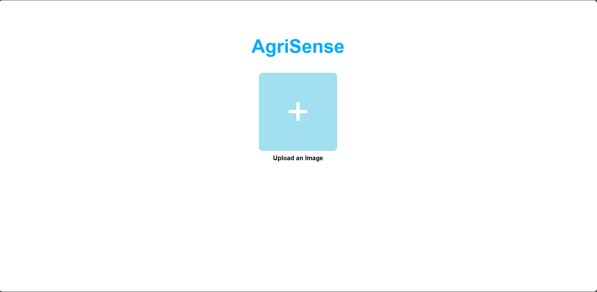
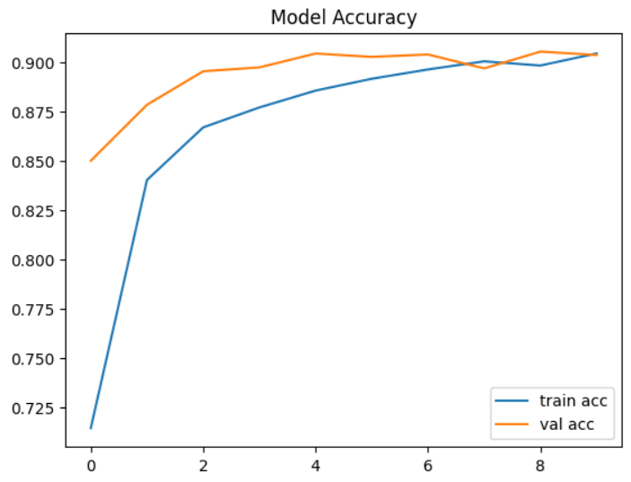
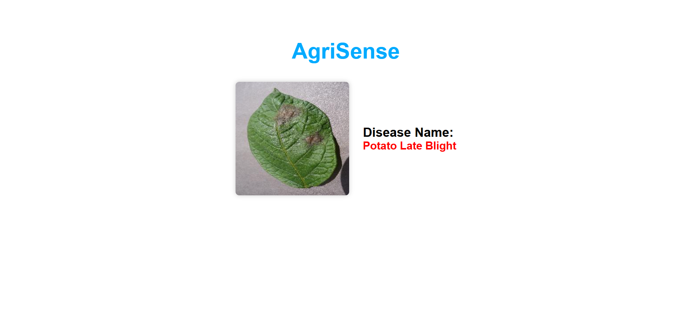

# 🌿 AgriSense - Plant Disease Detection Web App

AgriSense is a lightweight web application that allows users to upload plant leaf images and get real-time predictions of potential diseases using a deep learning model.

 <!-- Optional: include UI screenshot -->

---

## 🔍 Features

* 📸 Image upload interface
* 🤖 Deep learning-based disease classification (MobileNetV2)
* ⚡ Real-time predictions using Flask backend
* 📊 Trained on PlantVillage dataset
* 🧠 Uses TensorFlow, OpenCV, and Keras

---

## 🏗️ System Architecture


---

## 🚀 Getting Started

### 1. Clone the Repository

```bash
git clone https://github.com/yourusername/agrisense.git
cd agrisense
```

### 2. Install Dependencies

```bash
pip install -r requirements.txt
```

Or manually:

```bash
pip install tensorflow flask flask-cors opencv-python pillow
```

### 3. Run the Flask Server

```bash
python app.py
```

### 4. Open Frontend

Open `index.html` in your browser.

---

## 📁 Project Structure

```
agrisense/
├── app.py                    
├── plant_disease_model.h5    
├── images          
├── templates/
│   ├── index.html            
│   └── result.html           
└── README.md
```

---

## 🧠 Model Details

* Base Model: `MobileNetV2`
* Input Size: `128x128`
* Training: 10 epochs on PlantVillage dataset
* Optimizer: Adam, Loss: Categorical Crossentropy

---

## 💼 Model Accuracy



---

## 🖼️ Example Prediction Output




---

## 💡 Future Improvements

* Deploy on Render/Heroku
* Add confidence score
* Multi-language support
* REST API documentation with Swagger

---

## 🙌 Acknowledgements

* [PlantVillage Dataset](https://www.kaggle.com/datasets/emmarex/plantdisease)
* TensorFlow, Keras, Flask

---

## 📜 License

MIT License
